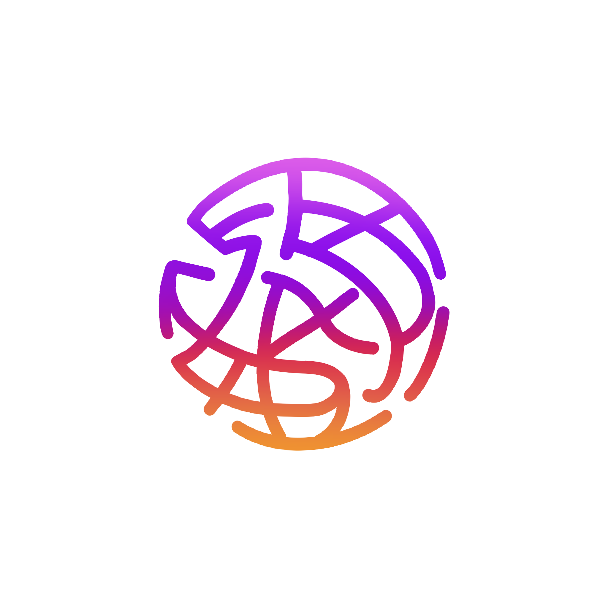
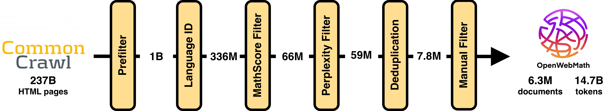

#  OpenWebMath: An Open Dataset of High-Quality Mathematical Web Text
[Keiran Paster](https://keirp.com)\*, [Marco Dos Santos](#)\*, [Zhangir Azerbayev](https://zhangir-azerbayev.github.io/), [Jimmy Ba](https://jimmylba.github.io/)


This codebase contains the code for the following stages of the OpenWebMath pipeline:

1. **Prefiltering**: Fast filters to remove most of the non-mathematical web documents from Common Crawl.
2. **Text Extraction**: Extracting text and LaTeX from HTML documents.
3. **Language Identification**: Identifying the language of the extracted text and filtering out non-English documents.
4. **MathScore Filtering**: Filtering out documents with low *MathScores*.
5. **Perplexity Filtering**: Filtering out documents with high perplexity.
6. **Deduplication**: Removing duplicate documents.

**OpenWebMath** is a dataset containing the majority of the high-quality, mathematical text from the internet. It is filtered and extracted from over 200B HTML files on Common Crawl down to a set of **6.3 million documents** containing a total of **14.7B tokens**. OpenWebMath is intended for use in *pretraining* and *finetuning* large language models.

You can download the dataset using Hugging Face:

```python
from datasets import load_dataset
ds = load_dataset("open-web-math/open-web-math")
```

Important Links:
- [ArXiv Paper](...)
- [GitHub Repository](...)
- [Paper Twitter Thread](...)

# OpenWebMath Contents

The dataset is structured as follows:

```python
{
  "text": ...,  # document text.
  "url": ...,  # document url.
  "date": ...,  # date the page was crawled.
  "metadata": ...,  # JSON containing information from the extraction process.
}
```

OpenWebMath contains documents from over 130k different domains, including data from forums, educational pages, and blogs. The dataset contains documents covering mathematics, physics, statistics, computer science, and more. The following table shows the most common domains in OpenWebMath by character count.

| Domain                | # Characters | % Characters |
|-----------------------|--------------|--------------|
| stackexchange.com     | 4,655,132,784| 9.55%        |
| nature.com            | 1,529,935,838| 3.14%        |
| wordpress.com         | 1,294,166,938| 2.66%        |
| physicsforums.com     | 1,160,137,919| 2.38%        |
| github.io             | 725,689,722  | 1.49%        |
| zbmath.org            | 620,019,503  | 1.27%        |
| wikipedia.org         | 618,024,754  | 1.27%        |
| groundai.com          | 545,214,990  | 1.12%        |
| blogspot.com          | 520,392,333  | 1.07%        |
| mathoverflow.net      | 499,102,560  | 1.02%        |

# OpenWebMath Pipeline



OpenWebMath builds on the massive [Common Crawl](https://commoncrawl.org/) dataset, which contains over 200B HTML documents. We filtered the data to only include documents that are: (1) in English, (2) contain mathematical content, and (3) are of high quality. We also put a strong emphasis on extracting LaTeX content from the HTML documents as well as reducing boilerplate in comparison to other web datasets.

The OpenWebMath pipeline consists of five steps:
1. **Prefiltering HTML Documents**:
    - We apply a simple prefilter to all HTML documents in Common Crawl in order to skip documents without mathematical content to unnecessary processing time.
    
2. **Text Extraction**:
    - Extract text, including LaTeX content, from the HTML documents while removing boilerplate.
    
3. **Content Classification and Filtering**:
    - Apply a [FastText language identification model](https://fasttext.cc/docs/en/language-identification.html) to keep only English documents.
    - Filter high perplexity documents using a [KenLM](https://github.com/kpu/kenlm) model trained on [Proof-Pile](https://huggingface.co/datasets/hoskinson-center/proof-pile).
    - Filter non-mathematical documents using our own *MathScore* model.
    
4. **Deduplication**:
    - Deduplicate the dataset using SimHash in [text-dedup](https://github.com/ChenghaoMou/text-dedup).
    
5. **Manual Inspection**:
    - Inspect the documents gathered from previous steps and remove low quality pages.

For a detailed discussion on the processing pipeline, please refer to our paper.

# License

OpenWebMath is made available under an ODC-By 1.0 license; users should also abide by the CommonCrawl ToU: [https://commoncrawl.org/terms-of-use/](https://commoncrawl.org/terms-of-use/). We do not alter the license of any of the underlying data.

# Citation Information

```
@article{openwebmath,
  title={OpenWebMath: An Open Dataset of High-Quality Mathematical Web Text},
  author={Keiran Paster and Marco Dos Santos and Zhangir Azerbayev and Jimmy Ba},
  journal={arXiv preprint arXiv:????.?????},
  eprint={????.?????},
  eprinttype = {arXiv},
  url={https://arxiv.org/abs/????.?????},
  year={2023}
}
```

# Code Structure

We provide code in this repository to reproduce our processing pipeline. The code is organized into three separate folders:

1. `text_extraction` contains the code for extracting text and LaTeX from HTML documents.
2. `extract_from_cc` contains the code for extracting the dataset from Common Crawl, including prefiltering, language identification, MathScore filtering, and perplexity filtering.
3. `filtering` includes many of the manual filtering steps, including blacklisted domains.

In order to run the `extract_from_cc` code, you either need to run it in Apache Spark or manually run `extract_from_warc.py` by passing in a WARC file as an argument.

For deduplication, please use the [text-dedup](https://github.com/ChenghaoMou/text-dedup) library.

Finally, for filtering, `filter.py` contains the code to load a Hugging Face dataset and filter it based on our heuristics.

The *MathScore* model and KenLM model will be released in the near future.